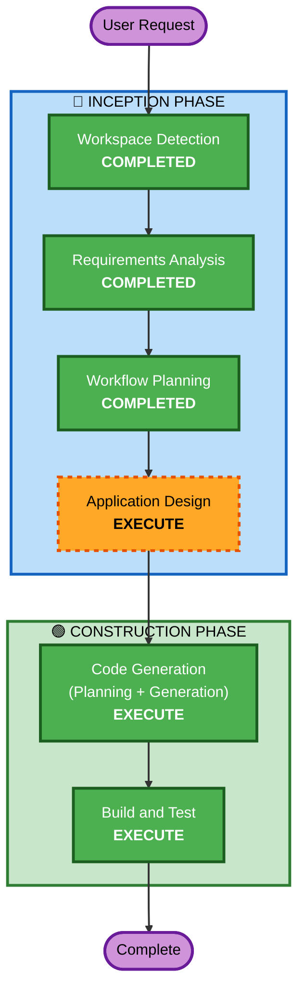

# Execution Plan

## Detailed Analysis Summary

### Change Impact Assessment
- **User-facing changes**: Yes — entirely new user-facing game
- **Structural changes**: N/A — greenfield
- **Data model changes**: No — no persistence, all in-memory game state
- **API changes**: No — no backend
- **NFR impact**: Minimal — performance target is 60fps canvas rendering

### Risk Assessment
- **Risk Level**: Low (greenfield prototype, no production dependencies)
- **Rollback Complexity**: Easy (git revert, no deployment)
- **Testing Complexity**: Simple (manual play-testing)

## Workflow Visualization

## Phases to Execute

### 🔵 INCEPTION PHASE
- [x] Workspace Detection (COMPLETED)
- [x] Requirements Analysis (COMPLETED)
- [ ] User Stories - SKIP
  - **Rationale**: Single-player prototype for a workshop, no complex personas or acceptance criteria needed
- [x] Workflow Planning (IN PROGRESS)
- [ ] Application Design - EXECUTE
  - **Rationale**: Need to define game components, their responsibilities, and how they interact (game loop, state machine, renderer, input handler, AI)
- [ ] Units Generation - SKIP
  - **Rationale**: Single unit of work — the entire game is one deliverable with no parallel development

### 🟢 CONSTRUCTION PHASE
- [ ] Functional Design - SKIP
  - **Rationale**: Game logic is straightforward from requirements; application design provides enough structure
- [ ] NFR Requirements - SKIP
  - **Rationale**: No special performance, security, or scalability requirements beyond basic 60fps canvas rendering
- [ ] NFR Design - SKIP
  - **Rationale**: NFR Requirements skipped
- [ ] Infrastructure Design - SKIP
  - **Rationale**: No infrastructure — static files opened in a browser
- [ ] Code Generation - EXECUTE (ALWAYS)
  - **Rationale**: Implementation planning and code generation needed
- [ ] Build and Test - EXECUTE (ALWAYS)
  - **Rationale**: Build instructions and manual test plan needed

### 🟡 OPERATIONS PHASE
- [ ] Operations - PLACEHOLDER
  - **Rationale**: No deployment needed for workshop prototype

## Estimated Timeline
- **Total Stages to Execute**: 3 remaining (Application Design → Code Generation → Build and Test)
- **Estimated Duration**: Fits within 4-hour workshop constraint

## Success Criteria
- **Primary Goal**: Playable penalty shootout game in browser with FIFA 94 aesthetic
- **Key Deliverables**: index.html + JS modules that run with no build step
- **Quality Gates**: Game is playable end-to-end (title → team select → shootout → result → replay)
