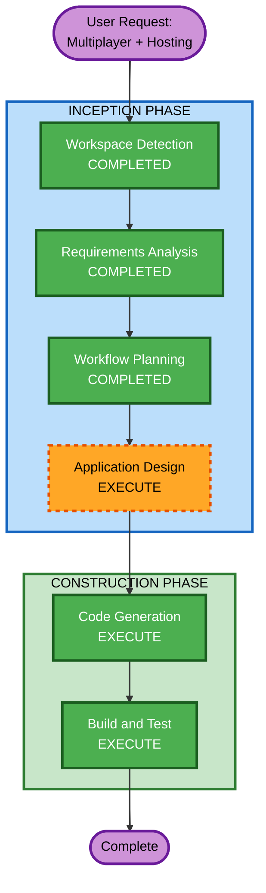

# Execution Plan — WC26 Penalty Shooter v2 (Multiplayer & Hosting)

## Detailed Analysis Summary

### Transformation Scope
- **Transformation Type**: Architectural (adding server component + networking layer to client-only app)
- **Primary Changes**: New WebSocket server, client networking layer, deployment infrastructure, game state synchronization
- **Related Components**: Existing game.js (refactor for multiplayer), new server package, deployment configs

### Change Impact Assessment
- **User-facing changes**: Yes — new multiplayer mode, room system, lobby UI
- **Structural changes**: Yes — client/server architecture replaces single-file client-only app
- **Data model changes**: Yes — game state must be serializable for network transmission
- **API changes**: Yes — WebSocket message protocol (client ↔ server)
- **NFR impact**: Yes — latency requirements, scalability, availability

### Risk Assessment
- **Risk Level**: Medium
- **Rollback Complexity**: Easy (v1 single-player remains untouched as fallback)
- **Testing Complexity**: Moderate (need to test both local and network play)

---

## Workflow Visualization



### Text Alternative
```
INCEPTION PHASE:
  1. Workspace Detection ............ COMPLETED
  2. Requirements Analysis .......... COMPLETED
  3. Workflow Planning ............... COMPLETED
  4. Application Design ............. EXECUTE

CONSTRUCTION PHASE:
  5. Code Generation ................ EXECUTE
  6. Build and Test ................. EXECUTE
```

---

## Phases to Execute

### INCEPTION PHASE
- [x] Workspace Detection (COMPLETED)
- [x] Requirements Analysis (COMPLETED)
- [ ] Reverse Engineering (SKIPPED)
  - **Rationale**: We built v1 ourselves; full understanding exists from aidlc-docs_v1/
- [ ] User Stories (SKIPPED)
  - **Rationale**: Clear two-player interaction model; requirements already capture all scenarios
- [x] Workflow Planning (IN PROGRESS)
- [ ] Application Design — **EXECUTE**
  - **Rationale**: New server component, WebSocket protocol design, client refactoring for networking layer — needs component/service identification and dependency mapping
- [ ] Units Generation (SKIPPED)
  - **Rationale**: Single unit of work — server and client changes are tightly coupled and should be developed together

### CONSTRUCTION PHASE
- [ ] Functional Design (SKIPPED)
  - **Rationale**: Game logic is well-understood from v1; multiplayer mostly changes how inputs arrive, not game mechanics
- [ ] NFR Requirements (SKIPPED)
  - **Rationale**: NFRs already defined in requirements (latency, scalability, deployment). No complex performance engineering needed for a turn-based game
- [ ] NFR Design (SKIPPED)
  - **Rationale**: No NFR requirements stage executed
- [ ] Infrastructure Design (SKIPPED)
  - **Rationale**: Hosting is straightforward (Vercel static + simple WebSocket host). No complex infrastructure-as-code needed
- [ ] Code Generation — **EXECUTE** (ALWAYS)
  - **Rationale**: Server code, client networking, deployment configuration all need implementation
- [ ] Build and Test — **EXECUTE** (ALWAYS)
  - **Rationale**: Need build/run instructions for both frontend and backend, plus testing guidance

---

## Remaining Stages Summary

| # | Stage | Phase | Status |
|---|-------|-------|--------|
| 1 | Application Design | INCEPTION | **EXECUTE** |
| 2 | Code Generation | CONSTRUCTION | **EXECUTE** |
| 3 | Build and Test | CONSTRUCTION | **EXECUTE** |

---

## Success Criteria
- **Primary Goal**: Two players on separate devices can play a penalty shootout against each other in real-time
- **Key Deliverables**:
  - WebSocket server (Node.js) with room management and game state logic
  - Updated game client with multiplayer mode and networking layer
  - Deployment configuration for Vercel (frontend) + WebSocket host (backend)
  - Single-player mode preserved and functional
- **Quality Gates**:
  - Both players can complete a full 5-round shootout over network
  - Disconnect correctly forfeits the match
  - Server rejects invalid game actions
  - Single-player mode unchanged from v1
